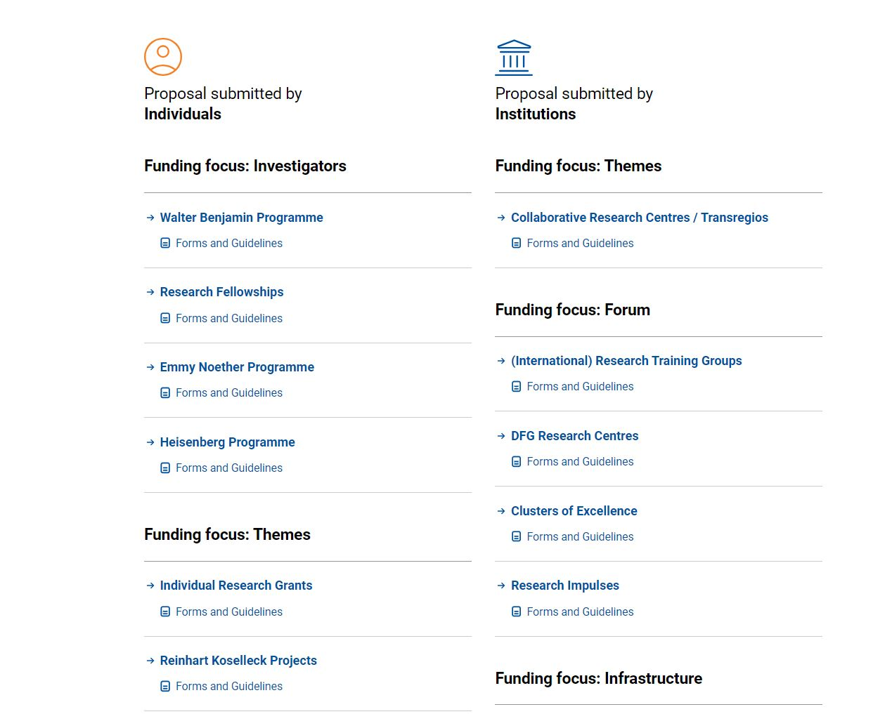

# ドイツでポスドクの次のステップへ

Leibniz-Institut für Kristallzüchtung (IKZ), Berlin, Germany

田中　裕樹 / Hiroki Tanaka

## 自己紹介

* ドイツでの研究生活が6年目に突入（長い！）
* Leibniz結晶成長研究所にてジュニアグループリーダー（JGL）として勤務
* ドイツ物理学・応用物理学セミナーの世話人
  * 年1回2月頃対面にてセミナーを開催
  * 前回はMax-Planck-Institut für Astrophysik@Garchingにて開催
  * ご興味がある方は是非メーリングリストに登録を！（登録希望の旨を田中までメールにてご連絡ください）
  * ホームページ: <https://sites.google.com/site/jpsingermany/>
* 青熊会（ベルリンエリア日本人研究者ネットワーク）幹事

## 経歴

* 2018年8月　慶應義塾大学理工学研究科　後期博士課程修了
* 2018年12月　ベルリンにあるLeibniz結晶成長研究所にてポスドクをスタート
* 2019年4月　同研究所にて名目JGLになる
* 2023年4月　はじめてドイツで研究グラント（DFG Eigenestelle）を獲得
* 2024年4月　JGL向け競争的資金を獲得（Leibniz Competition Programme）

## そもそも何故こんな話を？

* ポスドクは多くいるけれど殆どの人が2-4年で帰国してしまう（寂しい！）
* ドイツでのポスドク以降のキャリアパスはわかりにくい！日本語の資料もない！
* ポスドク以降のキャリアステップについての情報は一定のニーズがありそう

## このプレゼンを通して伝えたいこと

* ドイツでポスドク以降のキャリアに関する情報（ポスドクの次って？）
* 若手グループリーダー（JGL）になるための具体的な道筋（資金獲得）
* JGL向けの研究グラント（DFGなど）の選考プロセスに関する学びやヒント

## （私が考える）ドイツでの理想的なキャリアパス
<!--
_class: slide-tight
-->
1. 博士課程修了直後フェローシップを獲得 (2年間)
  - Alexander von Humboldt Fellowship
  - Marie Skłodowska-Curie Actions
  - DFG Walter Benjamin Programme
  - JSPS 海外特別研究員
2. 博士号取得から2-5年にJGL向け競争的資金を獲得
3. 大学でW2プロフェッサーになる or 研究所でパーマネントGLになる

## （ちょっと宣伝）AvH Fellowship

ミュンヘン工科大学の藤原素子さんが詳しい記事を執筆してくれています！
* 「フンボルト奨学金　応募のすすめ」
* <https://www2.yukawa.kyoto-u.ac.jp/~soken.editorial/sokendenshi/vol38/2/guide_humboldt_fellow.pdf>

# ジュニアグループリーダー

## そもそもジュニアグループリーダー（JGL）って？

*独立して研究グループを率いる若手研究者に対して提供されるポジションで、将来の独立した研究者としてのキャリアを築くための重要なステップ*

* **独立した研究者**として自分の研究グループを率いる
* 外部から**競争的研究資金**（独自の研究グループの立ち上げ・研究遂行資金）を獲得することが前提
* JGLを経て**テニュア教授職へステップアップ**する研究者が多い

## JGL向けファンディングプログラム

### 応募資格と選考プロセス

* 博士号取得後の年数による応募資格の制限（殆ど場合PhD defenceの日から数える）
* 産休・育休等のキャリアブレークの期間は考慮される
* 選考プロセスは書類審査＆プレゼンテーションの二段階
* 最終的な採否決定まで約7-8ヶ月

### JGL向けファンディングを獲得したらどうなる？

* 自分の研究グループを立ち上げることができる！
* 自分のPIポジションは5-6年間安泰!（必ず予算に含まれる）
* 博士学生或いはポスドクを複数名雇える!（3名程度雇用するのが一般的）
* 殆どの場合人件費で1M EURを超えるので、残りで備品・消耗品・旅費等を賄う

| プログラム               | 資金額          | 期間     | 対象者                     | 申請言語 | 採択率 |
|--------------------------|------------------|----------|----------------------------|-----|-----|
| ERC Starting Grant       | 1.5M EUR | 5年間     | 博士号取得後2～7年以内     | 英 | 15% |
| DFG Emmy Noether Programme | 1.5M EUR | 6年間     | 博士号取得後2～4年以内     | 英・独 | 20% |
| BMBF Nachwuchswettbewerb | >1.9M EUR | 5年間     | 博士号取得後2～5年以内     | 独 | ? |
| Helmholtz Young Investigator Groups | >1.5M EUR | 5年間     | 博士号取得後2～6年以内 | 英・独 | ? |
| Leibniz Junior Research Groups | 1.6M EUR* | 5年間     | 博士号取得後2～5年以内 | 英 | 20% |

*Leibniz協会が最大1M EUR出資。残りは所属研究所の基盤研究費によって賄われる。
- Max-Planck協会ではグループリーダー制度がこれに相当（https://www.mpg.de/career/max-planck-research-groups）
- Fraunhofer協会が同様のプログラムを提供しているかは把握できていません

### ERC Starting Grant

* 欧州研究会議（European Research Council）が提供する、**研究分野を問わない**プログラム
* **博士号取得から7年**まで申請可能（全プログラム中最長）
* 第三国からEU内の研究機関に異動して研究を行う場合は別途最大1M EURの支援が受けられる
* **PhD指導教員が関与しない論文が最低一本必要**
* 二次審査の採択率は約50%（と言われている）
* **評価結果に基づいて再申請の制限がある**
  - Step1での評価がC: 来年再申請できない
  - Step2での評価がC: 次の2年間は再申請できない
  - Step1での評価がB: 来年再申請できるが評価プロセスで不利になる可能性有り
  - Step2での評価がB: 来年再申請可能
* Link: https://erc.europa.eu/apply-grant/starting-grant

### DFG Emmy Noether Programme

* ドイツ学術振興会が提供する6年間のプログラム（中間審査あり）
* 応募資格が**博士号取得から4年間**で最も短い
* 外国籍の場合Letter of intent to pursue an academic career in Germanyを提出（ただの口約束なので気にする必要なし！）
* 一定の**教育義務**が課されるプログラム
* 一次審査は2件のExpert Review（大体半年掛かります）
* 二次審査はDFG Review Board（大学教授9人）を相手にしたプレゼンテーション25分+質疑25分 (WebExでした)
* Link: https://www.dfg.de/en/research-funding/funding-opportunities/programmes/individual/emmy-noether

#### Emmy Noetherは教授職への最短ルート

- W2/W3プロフェッサーはR4
- テニュアGLはR3もしくはR4
- JGLはR3相当とみなされる

### BMBF Nachwuchswettbewerb (junior competition)
- ドイツ連邦教育研究省（日本の文科省に相当）が提供するJGL向け競争的資金
- 資金は最も大きい（プログラム次第）
- 応募できる研究分野が限定される（国家戦略に基づいてプログラムが立ち上がる）
- 各プログラムの詳細はBMBFのHPにはなく管理委託されたProjectträgerのHPにあります！（見つけづらい！）
- **申請プロセスがドイツ語？**(BMBFの申請書類は基本的にすべてドイツ語です)

#### Quantum Futur

- https://www.quantentechnologien.de/forschung/foerderung/quantum-futur.html
- プロジェクト管理はドイツ技術者協会(VDI)
- 基礎的量子研究の成果を新たな応用へ移行させることを支援する
- 資金は定められていないが3-4M EURが多い

#### NanoMatFutur

- https://www.ptj.de/projektfoerderung/vom-material-zur-innovation/nanomatfutur
- プロジェクト管理はProjectträger Julich (PtJ)
- 産業界での新たな応用を刺激し、**化学、物理学、生物学、ナノテクノロジー、プロセスエンジニアリング**などの分野の限界を押し広げる優秀な若手研究者を支援する
- 資金は最大1.9M EUR
- ターゲット分野:
  1. Materials for energy technology
  2. Sustainable use of raw materials and resources
  3. Materials for mobility and transport
  4. Materials for health and quality of life
  5. Materials for future building systems

### 各研究協会が独自に提供するプログラム
- **Helmholz Young Investigator Groups** (Helmholtz協会)
  - https://www.helmholtz.de/en/career/careers-at-helmholtz/helmholtz-young-investigator-groups/
  - プログラム終了後、審査結果が良好であればパーマネントに
- **Leibniz Junior Research Groups** (Leibniz協会)
  - Leibniz Competition Programの枠組みの一つ
  - 各研究所毎年一件しか応募できない（事前に内部コンペ）
  - https://www.leibniz-gemeinschaft.de/forschung/leibniz-wettbewerb/leibniz-junior-research-groups/

# 私の経験

* ポスドクをスタートして数ヶ月後、研究所内の名目JGLになる（外部資金を獲得するまでは実質ポスドクのままで呼び方が違うだけ）
* **DFG Emmy Noether Programme**に申請 → 二次選考で不採択 :sob:
* 研究計画のボリュームを削減して**DFG Individual Research Grant**（Eigenestelle / Temporaly position of principal investigator）として再申請 → 採択 :smile:
* Leibniz協会が提供する**Leibniz Junior Research Groups**に申請 → 採択 :smile:

## Emmy Noether Programmeでの経験

### 二次選考で受けた質問

* 採択された場合の具体的な教育プランは？
* どのように博士学生を指導する？
* 提案するプロジェクトで各メンバーがどのような役割を担う？分担は？
* Habilitationはどうする？
* プログラム終了後のキャリアパスは？
* 今から10年後は何をしていると思う？

### 不採択からの反省と学び

* 専門的な質問はそこまで来ない（Review Boardに一人くらい比較的近いバックグラウンドの教授がいるかも）。むしろ学生指導や教育プラン、キャリア等に関する質問が多い（人となりを見られている感じ）
* **プロフェッサーになるまでのプランを具体的に提示**しよう！（プログラム終了後のキャリアは教授職と応える以外ない！）
* 「自身の研究をより発展させるにあたって〇〇の分野で強い□□研究センターがある▲▲大学で教授職を得られれば理想」のように具体的に答えられれば良かったと反省
* 教育プランもざっくりではなく具体的に準備しよう！
* **情報収集不足！**

## DFGは不採択でも再チャレンジできる！

* DFGは不採択の通知をメールで受け取ってから約6週間後にExpert Reviewのコメントと不採択理由が記載された手紙が送られてくる
* Emmy Noetherプログラムの場合はタイムリミットが短いので要注意
* Emmy Noetherの一次審査が通っていたら、通常のDFGグラントであれば採択されていた可能性が大!
* 研究計画を手直ししてDFG Individual Research Grantに再申請するのが常套手段

# DFG Individual Research Grant

* 所謂DFGプロポーザル
* 日本での科研費に相当するが、ほぼ人件費
* 大学教授はこれがないと博士学生・ポスドクを雇えない！
  * TVöD E13 75%: 174,000 EURくらい（2024）
* ファンディング規模について指定がないが、共同でない場合は300,000 EURが目安(分野によって異なる可能性があるので参考まで)
* 博士学生・ポスドクの代わりに自分のPIとしての人件費を計上することも可 → Eigenestelle / Temporary Positions for Principal Investigators

## DFG研究グラント申請のアドバイス

1. First time proposal（一度だけ使えるオプション）を活用しよう！
2. 「何を実証するか」ではなく「何を明らかにするか」にフォーカスしよう！
3. 新しい研究アイデアを晒す必要はない（と私は思います）

# まとめ

* ドイツはJGLという裁量のある若手PIポジションがある
* JGLになるには競争的資金獲得が必須
* タイムリミットがあるので早く行動して損はない（早めに経験を！）
* 不採択でもめげずに何度もチャレンジしよう！
* 情報収集は大事（遠慮せずダメ元でも聞いてみよう！）

# さいごに

* 今日の資料はGitHubに上がっています！
  https://github.com/hirokitanaka-ikz/german_academic_career
* 詳しい記事を執筆中です！
* 永野博先生著　「ドイツに学ぶ科学技術政策」がオススメ

